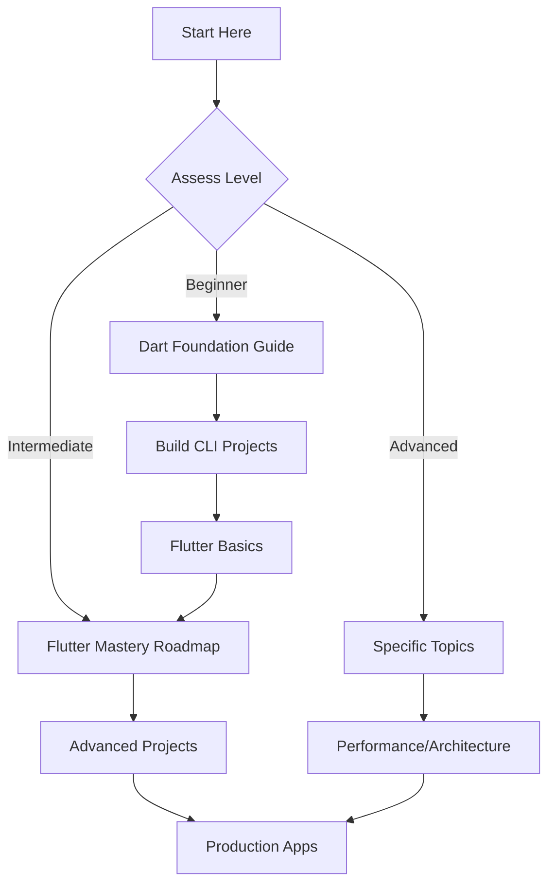

# 🚀 Flutter Mastery: Complete Learning Path

> **Comprehensive Flutter development curriculum from Dart fundamentals to expert-level engineering**
>
> Designed for developers who want to build production-ready, scalable Flutter applications

---

## 📚 Learning Path Overview

This repository contains a complete Flutter learning curriculum structured into three comprehensive guides:

### 🧠 [Dart Foundation Guide](./DART_FOUNDATION_GUIDE.md)
**Essential Dart skills before Flutter development**
- Core syntax and language fundamentals
- Object-oriented programming mastery
- Asynchronous programming and streams
- Modern Dart 3+ features
- Performance optimization
- **Duration**: 2-4 weeks
- **Prerequisite**: Basic programming knowledge

### 🎯 [Flutter Mastery Roadmap](./FLUTTER_MASTERY_ROADMAP.md)
**From intermediate to expert Flutter developer**
- Advanced Flutter internals and rendering
- State management excellence (Riverpod)
- Clean architecture and scalable design
- Platform integration and native development
- Testing, performance, and DevOps
- **Duration**: 3-6 months
- **Prerequisite**: Strong Dart fundamentals

---

## 🎯 Who This Is For

### ✅ Perfect For:
- **Intermediate Developers** who know basic Flutter but want to become experts
- **Android/iOS Developers** transitioning to Flutter
- **Web Developers** learning mobile development
- **Computer Science Students** wanting practical skills
- **Self-Taught Developers** seeking structured learning

### 🎯 Learning Goals:
- Build production-ready Flutter applications
- Understand Flutter internals and performance optimization
- Design scalable, maintainable architectures
- Master state management and data flow
- Deploy and monitor apps in production

---

## 🚀 Quick Start Guide

### 1️⃣ Assess Your Current Level

**Beginner (New to Flutter)**
```bash
# Start with Dart fundamentals
📖 Read: DART_GUIDE.md
⏱️  Duration: 2-4 weeks
🎯 Goal: Build CLI apps with async operations
```

**Intermediate (Know Flutter basics)**
```bash
# Skip to advanced concepts
📖 Read: FLUTTER_ROADMAP.md
⏱️  Duration: 3-6 months
🎯 Goal: Build production-grade apps
```

**Advanced (Flutter experience)**
```bash
# Focus on specific areas
📖 Skim: Both guides for gaps
⏱️  Duration: 1-3 months
🎯 Goal: Expert-level engineering
```

### 2️⃣ Choose Your Learning Path



### 3️⃣ Set Up Your Environment

```bash
# Install Flutter SDK
https://flutter.dev/docs/get-started/install

# Set up your IDE
- VS Code with Flutter extension
- OR Android Studio/IntelliJ

# Verify installation
flutter doctor
```

---

## 📖 Curriculum Structure

### 🧠 Phase 1: Dart Foundation (2-4 weeks)

**Week 1: Core Fundamentals**
- Variables, types, and control flow
- Functions and basic OOP
- Collections and data manipulation

**Week 2: Object-Oriented Programming**
- Classes, constructors, and inheritance
- Mixins and abstract classes
- Error handling and debugging

**Week 3: Advanced Concepts**
- Generics and extensions
- Async programming (Futures & Streams)
- Modern Dart 3+ features

**Week 4: Practice & Projects**
- Build CLI applications
- Performance optimization
- Code organization

### 🎯 Phase 2: Flutter Mastery (3-6 months)

**Month 1: Flutter Fundamentals**
- Widget system and rendering
- Layout and UI components
- Basic state management

**Month 2: Architecture & State**
- Clean architecture patterns
- Riverpod state management
- Data flow and networking

**Month 3: Advanced Development**
- Custom widgets and painting
- Platform integration
- Performance optimization

**Month 4+: Production Excellence**
- Testing strategies
- DevOps and deployment
- Advanced topics and specialization

---

## 🛠️ Project-Based Learning

### 📱 Portfolio Projects You'll Build

**Dart Foundation Projects:**
1. **CLI Todo Manager** - Command-line productivity app
2. **JSON Parser Library** - Type-safe serialization
3. **Async Data Pipeline** - Stream processing system
4. **Generic Repository** - Data access patterns

**Flutter Mastery Projects:**
1. **E-commerce App** - Complete shopping experience
2. **Social Media App** - Real-time messaging and feeds
3. **Productivity Dashboard** - Complex state management
4. **Media Streaming App** - Performance optimization
5. **Enterprise App** - Clean architecture showcase

### 🏆 Advanced Capstone
Build a production-ready application that demonstrates:
- Clean architecture
- Advanced state management
- Performance optimization
- Comprehensive testing
- Production deployment

---

## 📊 Progress Tracking

### 📈 Skill Assessment Matrix

| Level | Dart Skills | Flutter Knowledge | Project Complexity | Production Readiness |
|-------|-------------|-------------------|-------------------|---------------------|
| **Beginner** | Basic syntax | Widget basics | Simple apps | ❌ Not ready |
| **Intermediate** | OOP & async | Layout & navigation | Medium apps | 🟡 Limited |
| **Advanced** | Advanced patterns | Custom solutions | Complex apps | ✅ Ready |
| **Expert** | Performance mastery | Architecture design | Enterprise apps | ✅ Production |

### 🎯 Milestone Badges

- 🥉 **Dart Foundation** - Complete CLI projects
- 🥈 **Flutter Developer** - Build 3+ Flutter apps
- 🥇 **Flutter Engineer** - Production-ready architecture
- 🏆 **Flutter Expert** - Lead technical decisions

---

## 🌟 Key Features of This Curriculum

### ✅ What Makes This Different

**🎯 Practical Focus**
- Real-world projects, not just theory
- Production-ready code examples
- Industry best practices

**📈 Structured Progression**
- Clear learning milestones
- Skill assessment checkpoints
- Progressive complexity

**🛠️ Modern Development**
- Dart 3+ features
- Latest Flutter patterns
- Current industry standards

**🏗️ Architecture Excellence**
- Clean architecture principles
- Scalable design patterns
- Performance optimization

**🧪 Comprehensive Testing**
- Unit, widget, and integration tests
- Test-driven development
- Quality assurance practices

---


## 🚀 Getting Started Right Now

### 📋 Today's Action Plan

**Step 1: Setup (15 minutes)**
```bash
# Install Flutter if not already done
# Clone this repository
git clone [repository-url]
cd flutter-mastery

# Open the appropriate guide
# Beginner: DART_FOUNDATION_GUIDE.md
# Intermediate: FLUTTER_MASTERY_ROADMAP.md
```

**Step 2: Self-Assessment (10 minutes)**
- Complete the skill assessment in your guide
- Mark your current knowledge level
- Set realistic goals

**Step 3: First Learning Session (30-60 minutes)**
- Read the introduction
- Complete the first section
- Try the first practice exercise

**Step 4: Daily Habit Setup**
- Schedule daily learning time
- Set up a study space
- Join a study group or find accountability partner

### 🎯 Success Tips

**Consistency Over Intensity:**
- 30 minutes daily > 4 hours weekly
- Small, consistent progress
- Regular practice and review

**Project-Based Learning:**
- Build something after each concept
- Apply knowledge immediately
- Create a portfolio of projects

**Community Engagement:**
- Ask questions early
- Help others when you can
- Share your progress and projects
---

## 🎉 Your Journey Starts Now

**Flutter development is one of the most in-demand skills in the tech industry today.** With this comprehensive curriculum, you have everything you need to go from beginner to expert.

**Remember:**
- 🎯 **Start where you are** - Don't skip fundamentals
- 🚀 **Build consistently** - Small daily progress
- 🤝 **Learn together** - Join the community
- 🏆 **Celebrate progress** - Every milestone counts

**Your future as a Flutter expert starts with this first step. Let's build something amazing together!**

---

> **💡 Final Thought**: The best time to start was yesterday. The second best time is now.
>
> **🚀 Ready to begin?** Open the guide that matches your level and start your first lesson today!
